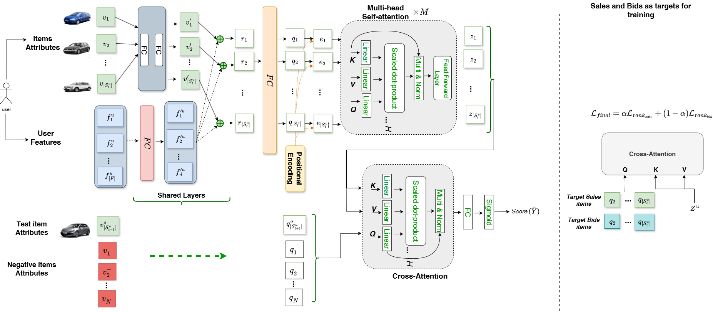

# Attribute-Aware Sequential Recommendation Model for Used Car Auctions
> Shereen Elsayed*, Ngoc Son Le*, Ahmed Rashed*, Lukas Hestermeyer, Radoslaw Wlodarczyk, Maximilian Stubbemann, and Lars Schmidt-Thieme  
> ECML PKDD 2025, Applied Data Science Track  
> \* Equal contribution

## Overview

This repository contains the implementation of **ASRM**, an attribute-aware sequential recommendation model for used car auction systems. In this setting, vehicles are unique items: each car is typically available only once, either through fixed-price rounds or auction rounds. This makes the task different from standard sequential recommendation, where the same item can often be recommended repeatedly.

ASRM addresses this setting by relying on vehicle attributes rather than conventional reusable item IDs. The model is designed for next-item prediction in used car auctions and is further extended as **ASRM++** to improve recommendation performance in the unique-item setting.

<p align="center">
  
</p>

<p align="center">
  <em>Illustration of the deployed Attribute-aware Model Architecture.</em>
</p>

## Data

The original experiments are based on a real-world used car auction dataset from Volkswagen Financial Services. Due to confidentiality restrictions, the raw dataset is not included in this repository.

## Acknowledgement
The code was built on top of the implementation of [ProxyRCA](https://github.com/theeluwin/ProxyRCA). We thank the authors for providing a valuable foundation. 

This work was conducted at the Information Systems and Machine Learning Lab (ISMLL) and the VWFS Data Analytics Research Center (VWFS DARC), University of Hildesheim, with support from Volkswagen Financial Services AG.

## Citation
```
@inproceedings{elsayed2025asrm,
  title     = {Attribute-Aware Sequential Recommendation Model for Used Car Auctions},
  author    = {Elsayed, Shereen and Le, Ngoc Son and Rashed, Ahmed and Hestermeyer, Lukas and Wlodarczyk, Radoslaw and Stubbemann, Maximilian and Schmidt-Thieme, Lars},
  booktitle = {Machine Learning and Knowledge Discovery in Databases. Applied Data Science Track},
  pages     = {161--177},
  year      = {2025},
  publisher = {Springer Nature Switzerland},
  doi       = {10.1007/978-3-032-06118-8_10}
}
```
